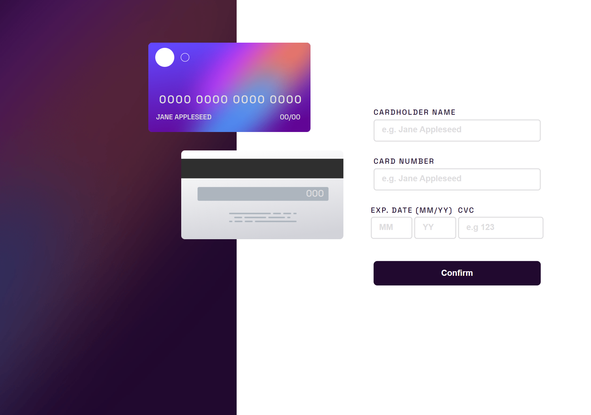
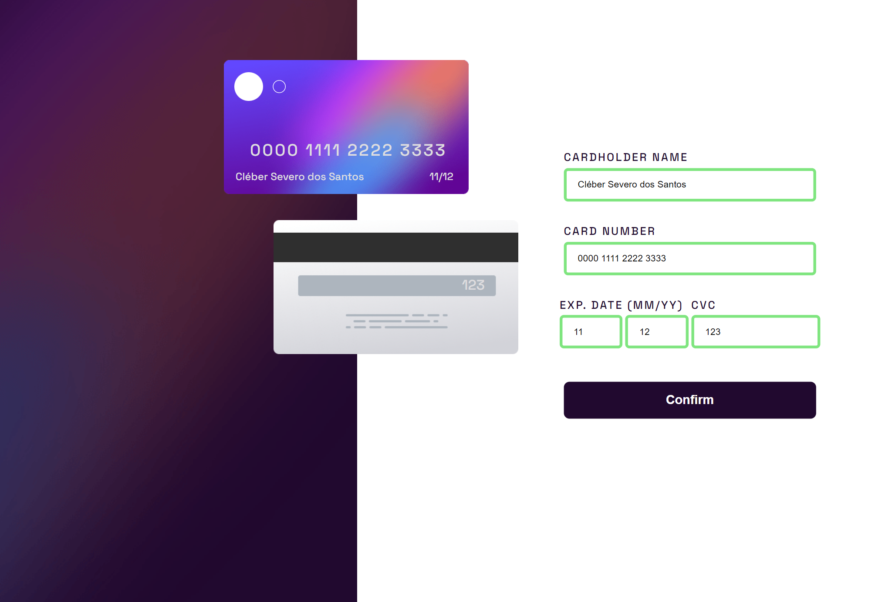
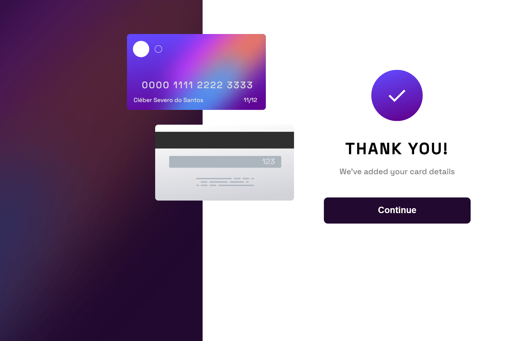
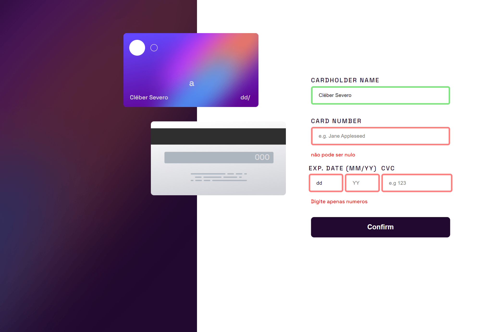
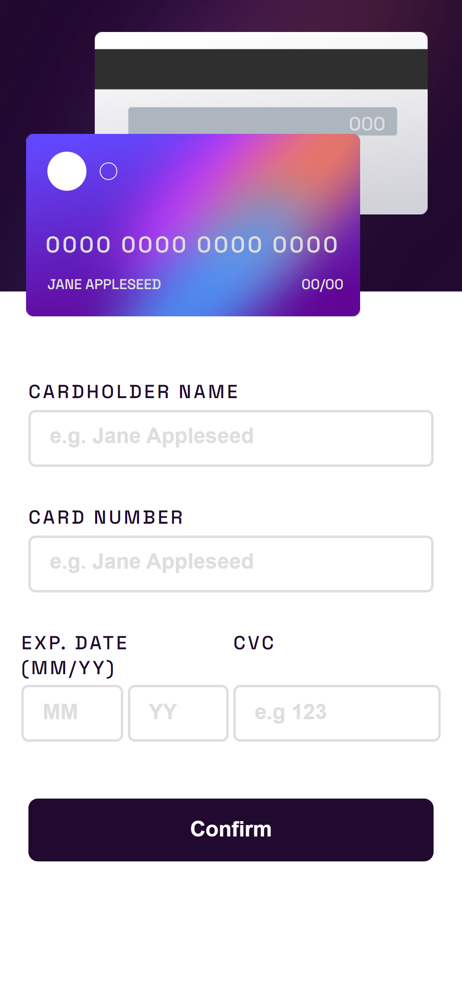
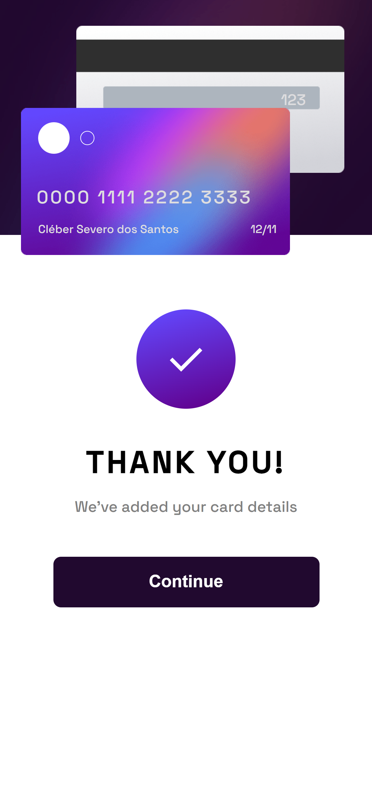

# Cartão Interativo

## Hello world \o/
Hello! I woud like to thank you for having a look on my project, this time I went completly out of my confort zone, I had to learn a lot o new stuff and explore a whole new area of knoledge but as aways: even by all the struggle and time spent...it was all worth it at the end of de day :) 

## The project
It is a fictional credit card form that shows the inputs of the user and displays it in the screen automatically, it is a HTML|CSS and JavaScript project with responsive layout.  

This project is a front-end challenge made by **FontEnd Mentor**

## How does it work ?
The user types the inputs following the correct types and with all the inputfields done correctly, the user gets to a success message in the screen. If the inputs are empty or in wrong format the form will show error messages. 

## Project design

**Fisrt page** 
 
 
 **First page with interactions** 
 
   
 **success screen** 
 

 **Error messages** 
  

**Responsive** 
  
  
